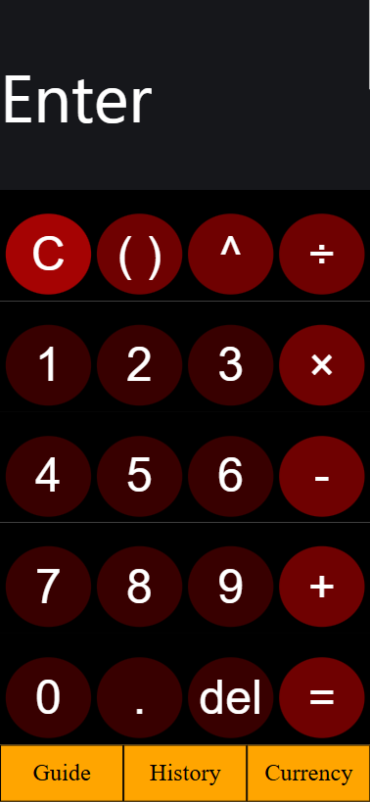
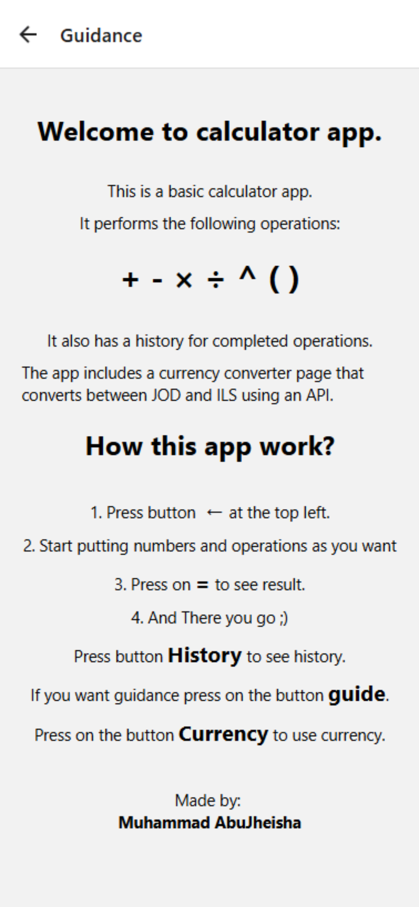

# Calculator App

A feature-rich mobile calculator application built with React Native and Expo. The app provides scientific calculations, calculation history tracking, and real-time currency conversion between Jordanian Dinar (JOD) and Israeli Shekel (ILS).

## 🎥 Demo Video

Watch the app in action: [YouTube Demo](https://youtu.be/1G2KpvWAAtY)

## 📸 Screenshots

<p align="center">
  
  
  
</p>

## 📱 Features

### Core Calculator

- **Basic Operations**: Addition (+), Subtraction (-), Multiplication (×), Division (÷)
- **Advanced Operations**: Exponentiation (^), Parentheses ( ), Delete button
- **Clear Functionality**: Quick clear button (C) to reset the display
- **Expression Evaluation**: Accurate mathematical expression evaluation
- **Error Handling**: Graceful error messages for invalid expressions

### Calculation History

- **Persistent Storage**: All calculations are automatically saved to device storage
- **History Display**: View all previous calculations in an organized list
- **AsyncStorage Integration**: Data persists between app sessions
- **Scrollable List**: Easily browse through calculation history

### Currency Converter

- **Live Exchange Rates**: Real-time currency conversion using Exchange Rate API
- **JOD ↔ ILS Conversion**: Convert between Jordanian Dinar and Israeli Shekel
- **Bidirectional**: Convert in both directions seamlessly
- **Dynamic Rates**: Automatically fetches latest exchange rates on app startup
- **Arabic Support**: Fully localized in Arabic (محول العملات)

### User Interface

- **Dark Theme**: Modern dark UI with high contrast for easy reading
- **Responsive Design**: Optimized for various mobile screen sizes
- **Intuitive Navigation**: Easy navigation between Calculator, History, Currency, and Guide screens
- **Touch-Optimized**: Large, easy-to-tap buttons

## 🛠️ Technologies & Stack

- **React Native 0.76.7** - Cross-platform mobile framework
- **Expo 52.0.35** - Development platform and runtime
- **React 18.3.1** - Core UI framework
- **React Navigation 7.1.8** - In-app navigation and routing
- **AsyncStorage 2.1.2** - Local data persistence
- **Exchange Rate API** - Real-time currency conversion data

## 📋 Prerequisites

- **Node.js** (v14 or higher)
- **npm** or **yarn**
- **Expo CLI** installed globally
- **Expo Go** app (for testing on mobile devices)

## 🚀 Installation & Setup

1. **Clone the repository**

   ```bash
   git clone <repository-url>
   cd project
   ```

2. **Install dependencies**

   ```bash
   npm install
   ```

3. **Start the development server**

   ```bash
   npm start
   # or
   expo start
   ```

4. **Run on different platforms**
   - **Android**: Press `a` in the terminal or run `npm run android`
   - **iOS**: Press `i` in the terminal or run `npm run ios`
   - **Web**: Press `w` in the terminal or run `npm run web`

## 📖 How to Use

### Calculator Screen

1. **Enter Calculation**: Tap number and operation buttons to build your expression
   - Supports up to 2 decimal places
   - Use `( )` for grouping expressions
   - Use `^` for exponentiation (e.g., 2^3 = 8)

2. **Calculate**: Press the `=` button to evaluate your expression

3. **Clear**: Press `C` to clear the display and start fresh

4. **Delete**: Press `del` to remove the last character

5. **Edit Display**: Click directly in the text box to edit your expression

### History Screen

1. **View History**: Tap the `History` button from the calculator screen
2. **Browse**: Scroll through all your previous calculations
3. **Format**: Each entry shows the expression and result (e.g., "2+2=4")

### Currency Converter Screen

1. **Access**: Tap the `Currency` button from the calculator screen
2. **Convert JOD to ILS**: Enter amount in the "المبلغ بالدينار" field (Jordanian Dinar)
3. **Convert ILS to JOD**: Enter amount in the "المبلغ بالشيكل" field (Israeli Shekel)
4. **View Rate**: Current exchange rate displayed at the top (updates automatically)

### Guidance Screen

1. **Help**: Tap the `Guide` button to view instructions
2. **Tutorial**: Step-by-step guide on how to use the calculator
3. **Features**: Overview of all available operations and features

## 📁 Project Structure

```
project/
├── App.jsx                          # Main app component with navigation
├── screens/
│   ├── Calculator.jsx               # Main calculator screen
│   ├── History.jsx                  # Calculation history display
│   ├── CurrencyConverter.jsx        # Currency conversion feature
│   └── Guidance.jsx                 # Help and guidance screen
├── assets/                          # App icons and images
├── package.json                     # Project dependencies
├── app.json                         # Expo configuration
├── README.md                        # This file
└── index.js                         # Entry point
```

## 🔑 Key Implementation Details

### State Management

- Uses React Hooks (useState, useEffect) for local state management
- AsyncStorage for persistent storage across app sessions

### Data Flow

1. **Calculator Input** → User presses buttons
2. **Expression Evaluation** → Function constructor safely evaluates math expressions
3. **History Update** → Result added to history and saved to AsyncStorage
4. **Display Update** → Result shown in text box

### API Integration

- **Exchange Rate API**: Fetches live conversion rates on component mount
- **Fallback Rate**: Default rate (5.2) used if API call fails
- **Real-time Updates**: Exchange rates update when the app loads

### Error Handling

- Invalid expressions show "Error" message
- AsyncStorage errors logged to console
- API failures use fallback exchange rate

## 🎨 UI Customization

The app uses React Native StyleSheet for styling:

- **Dark Theme Colors**: #16171b (dark), #380000 (red-dark), #6f0101 (red)
- **Buttons**: Rounded circles (borderRadius: 50%) for modern appearance
- **Responsive Units**: Flexible layouts using Flexbox and percentages

## 🚀 Future Enhancements

Potential features to add:

- Scientific functions (sin, cos, tan, log, etc.)
- Calculation graph visualization
- Dark/Light theme toggle
- Multi-language support
- Calculation categories/tags
- Export history as PDF
- Voice input for calculations
- Custom number formatting options

## 📝 Notes

- All calculations are stored locally on the device
- History persists even after closing the app
- Currency conversion requires internet connection for live rates
- Supports Arabic UI text for localization

## 👤 Author

**Muhammad AbuJheisha**

Developed as part of Mobile Devices Programming coursework

## 📄 License

This project is open source and available for educational purposes.

## 💡 Tips & Tricks

- **Pro Tip 1**: Use parentheses to group complex expressions: (5+3)\*2 = 16
- **Pro Tip 2**: Clear history by clearing your device storage if needed
- **Pro Tip 3**: Exchange rates update on app startup for accuracy
- **Pro Tip 4**: You can manually type in the calculator text box for quick edits
